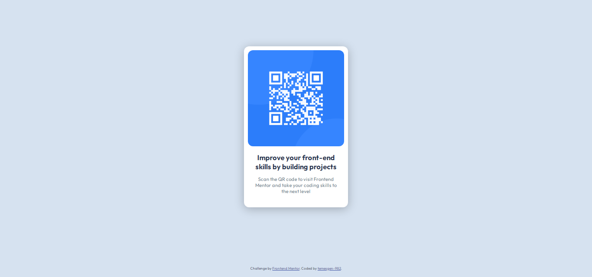

# Frontend Mentor - QR code component solution

  

This is a solution to the [QR code component challenge on Frontend Mentor](https://www.frontendmentor.io/challenges/qr-code-component-iux_sIO_H).


### Screenshot

  



 

### Links

  

- Solution URL: [Frontend Mentor](https://www.frontendmentor.io/solutions/qr-code-component-using-grid-no-flexbox-4X9Oxtx-k9)

- Live Site URL: [https://temesgen-982.github.io/qr-code-component-main/](https://temesgen-982.github.io/qr-code-component-main/)

  

### Built with

  

- HTML5

- CSS custom properties

- CSS Grid
  
### What I learned


```css
  justify-self: center;
```
You can definitely using ``` margin: auto; ``` to center a grid item but I wanted to use specific values on the margins for the sides of the main container.

### Continued development
- Organizing the CSS file in a better way